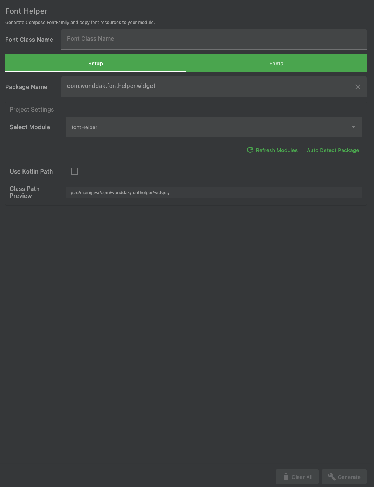
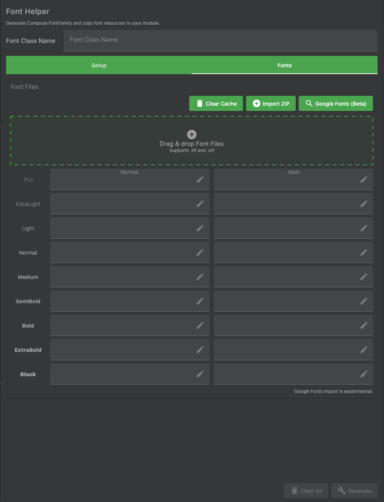
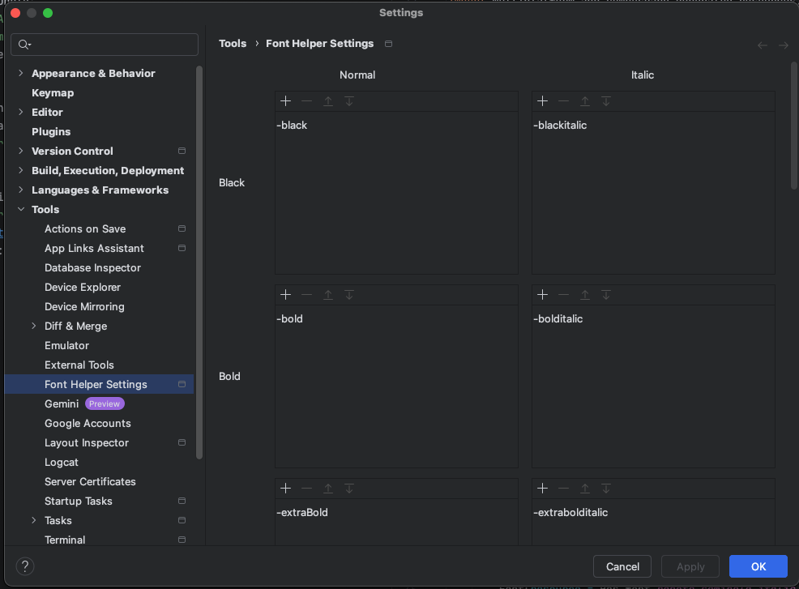
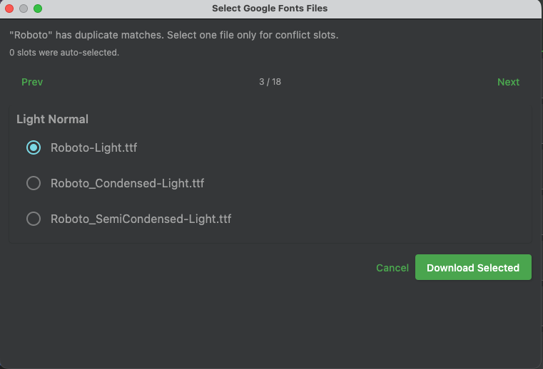
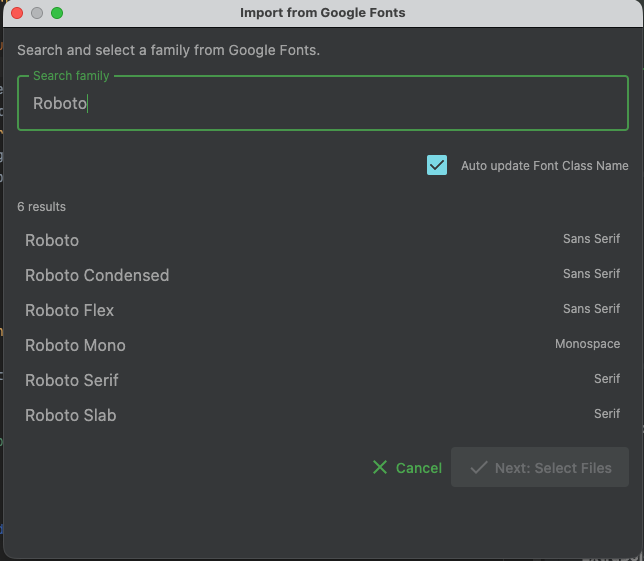
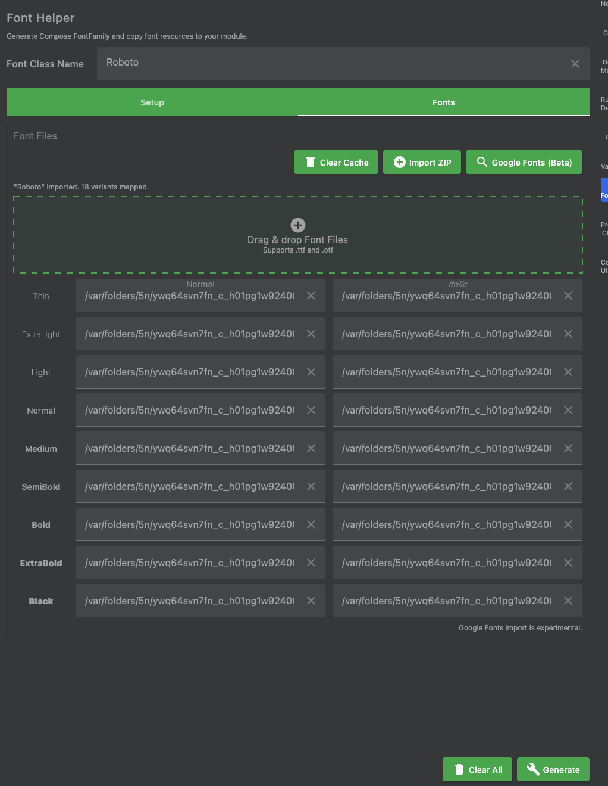

# Font Helper Plugin

<!-- Plugin description -->
**Compose FontFamily generator for Android Studio and IntelliJ.**

Font Helper generates Kotlin `FontFamily` code and automatically copies font files into the correct module paths for Android Compose and Compose Multiplatform projects.

**Key features:**

- Drag & drop font import (`.ttf`, `.otf`)
- ZIP import with automatic weight/style matching and conflict resolution
- Google Fonts import flow (Beta)
- Package name auto-detection with one-click generation
- Setup/Fonts tab layout to reduce long scrolling in the tool window
- Automatic module list refresh after Gradle sync completion

**Resources:**

- [GitHub Repository](https://github.com/jmseb3/Android_Font_Helper_Plugin) – Source code & documentation
<!-- Plugin description end -->

## Install

Search **Font Helper** in JetBrains Marketplace, or install from:
- [Plugin page](https://plugins.jetbrains.com/plugin/21596)

## Open Tool Window

Open the **FontHelper (FF)** tool window from the IDE right side.
The main screen is now split into **Setup** and **Fonts** tabs to reduce long scrolling.

## Quick Start

1. Enter **Font Class Name**.
2. Select **Module**.
3. Confirm/adjust **Package Name**.
  Package name is auto-detected from module sources/manifest and can be refreshed with **Auto Detect Package**.
4. Add font files.
5. Click **Generate** (fixed at the bottom action bar).

## Add Font Files

- Drag & drop into the dashed drop area.
- Drag & drop directly into each field.
- Use the folder button in each field.
- Import from downloaded ZIP.
- Import from Google Fonts (**Beta**).

### Keyword-Based Matching

When importing multiple files, Font Helper maps files to weight/style by filename keywords (case-insensitive).

Customize matching rules in:
- `Settings > Tools > Font Helper Settings`

| Font Weight | Normal Keyword  | Italic Keyword       |
|---|---|---|
| Thin | `-thin` | `-thinitalic` |
| ExtraLight | `-extralight` | `-extralightitalic` |
| Light | `-light` | `-lightitalic` |
| Regular | `-regular` | `-italic` |
| Medium | `-medium` | `-mediumitalic` |
| SemiBold | `-semibold` | `-semibolditalic` |
| Bold | `-bold` | `-bolditalic` |
| ExtraBold | `-extrabold` | `-extrabolditalic` |
| Black | `-black` | `-blackitalic` |

If multiple files match the same slot, Font Helper opens a conflict dialog with **Prev/Next** slot navigation so you can choose one file per slot.

## Google Fonts

Google import uses `download/list?family=...` metadata first, then downloads only selected files.

- Marked as **experimental** in UI.
- Manifest list is cached temporarily to reduce repeated requests.
- Downloaded files are cached and reusable.
- **Clear Cache** removes downloaded cache files and cached manifests.

## Output Paths

| Output | Android | Compose Multiplatform |
|---|---|---|
| Class File | ./&lt;module&gt;/src/main/&lt;java\|kotlin&gt;/&lt;packageName&gt; | ./&lt;module&gt;/src/commonMain/kotlin/&lt;packageName&gt; |
| Font Files | ./&lt;module&gt;/src/main/res/font | ./&lt;module&gt;/src/commonMain/composeResources/font |
## Generated Naming

- Font file: `(className)_(weight)[_italic].ttf`
- Class file: `[ClassName].kt`

After generation, the plugin refreshes project files so new files appear immediately.
