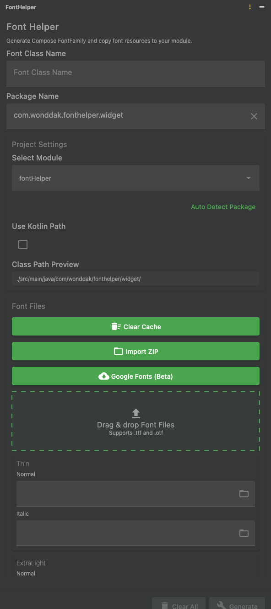

# Font Helper Plugin

`Font Helper` generates Compose `FontFamily` code and copies font files into the correct module path for:
- Android Compose
- Compose Multiplatform

Current release line: **2.1.x**

## Install

Search **Font Helper** in JetBrains Marketplace, or install from:
- [https://plugins.jetbrains.com/plugin/21596-fonthelper](https://plugins.jetbrains.com/plugin/21596-fonthelper)

## Open Tool Window

Open the **FontHelper (FF)** tool window from the IDE right side.

## Quick Start

1. Enter **Font Class Name**.
2. Select **Module**.
3. Confirm/adjust **Package Name**.
  Package name is auto-detected from module sources/manifest and can be refreshed with **Auto Detect Package**.
4. Add font files.
5. Click **Generate** (fixed at the bottom action bar).

## Add Font Files

- Drag & drop into the dashed drop area.
- Drag & drop directly into each field.
- Use the folder button in each field.
- Import from downloaded ZIP.
- Import from Google Fonts (**Beta**).

### Keyword-Based Matching

When importing multiple files, Font Helper maps files to weight/style by filename keywords (case-insensitive).

Customize matching rules in:
- `Settings > Tools > Font Helper Settings`

| Font Weight | Normal Keyword  | Italic Keyword       |
|---|---|---|
| Thin | `-thin` | `-thinitalic` |
| ExtraLight | `-extralight` | `-extralightitalic` |
| Light | `-light` | `-lightitalic` |
| Regular | `-regular` | `-italic` |
| Medium | `-medium` | `-mediumitalic` |
| SemiBold | `-semibold` | `-semibolditalic` |
| Bold | `-bold` | `-bolditalic` |
| ExtraBold | `-extrabold` | `-extrabolditalic` |
| Black | `-black` | `-blackitalic` |

If multiple files match the same slot, Font Helper opens a conflict dialog with **Prev/Next** slot navigation so you can choose one file per slot.

## Google Fonts (Beta)

Google import uses `download/list?family=...` metadata first, then downloads only selected files.

- Marked as **experimental** in UI.
- Manifest list is cached temporarily to reduce repeated requests.
- Downloaded files are cached and reusable.
- **Clear Cache** removes downloaded cache files and cached manifests.

## Output Paths

| Output | Android | Compose Multiplatform |
|---|---|---|
| Class File | `./[module]/src/main/[java|kotlin]/[packageName]` | `./[module]/src/commonMain/kotlin/[packageName]` |
| Font Files | `./[module]/src/main/res/font` | `./[module]/src/commonMain/composeResources/font` |

## Generated Naming

- Font file: `(className)_(weight)[_italic].ttf`
- Class file: `[ClassName].kt`

After generation, the plugin refreshes project files so new files appear immediately.
