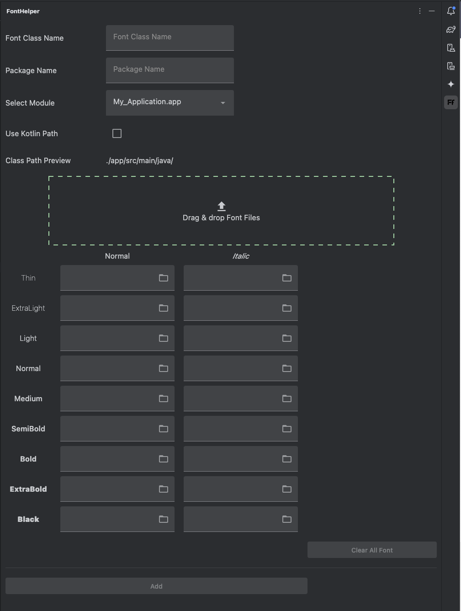

# Font Helper Plugin V2

A font generator plugin for **Android Compose** and **Compose Multiplatform**.  
Easily create `FontFamily` classes with just a few clicks.

---

## How to Install

Search for **"Font Helper"** in the JetBrains Plugin Marketplace,  
or click this [link](https://plugins.jetbrains.com/plugin/21596-fonthelper).

---

## How to Use

> Click the **FontHelper icon (FF)** in the right-side tool window of the IDE.

---

### Steps

1. Enter the **Font Class Name**.
2. Enter the **Package Name** (optional).
3. Select the **Module**.
4. Add your **Font Files**.

---

### Ways to Add Font Files

- **Drag and drop** font files into the dashed box area.

When dragging multiple files, the plugin will detect each file based on its name.  
File name detection is **case-insensitive**, and it uses specific keywords to determine which font weight and style each file represents.

You can customize the detection keywords in  
`Settings > Tools > Font Helper Settings`.

| Font Weight | Normal Keyword     | Italic Keyword        |
|-------------|--------------------|------------------------|
| Thin        | `-thin`            | `-thinitalic`          |
| ExtraLight  | `-extralight`      | `-extralightitalic`    |
| Light       | `-light`           | `-lightitalic`         |
| Regular     | `-regular`         | `-italic`              |
| Medium      | `-medium`          | `-mediumitalic`        |
| SemiBold    | `-semibold`        | `-semibolditalic`      |
| Bold        | `-bold`            | `-bolditalic`          |
| ExtraBold   | `-extrabold`       | `-extrabolditalic`     |
| Black       | `-black`           | `-blackitalic`         |

- You can also drag and drop files directly into the corresponding text fields.
- Or, click the folder icon next to each field to select files manually.

---

### Output Paths

|                 | Android Path                                           | Compose Multiplatform Path                             |
|-----------------|--------------------------------------------------------|--------------------------------------------------------|
| **Class File**  | `./[module]/src/main/[java or kotlin]/[packageName]`   | `./[module]/src/commonMain/kotlin/[packageName]`       |
| **Font Files**  | `./[module]/src/main/res/font`                         | `./[module]/src/commonMain/composeResources/font`       |

---

### Example Output

Click the **Add** button to generate the font class and copy the font files.

- **Font file name format:**  
  `(ClassName)_(FontWeight)_(FontType).ttf`

- **Class file name format:**  
  `[ClassName].kt`

---
